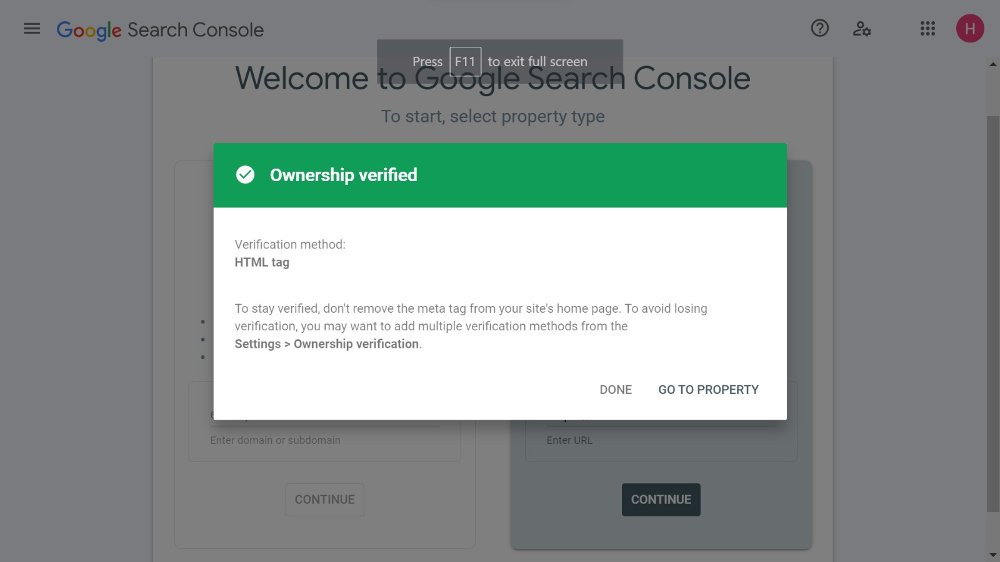
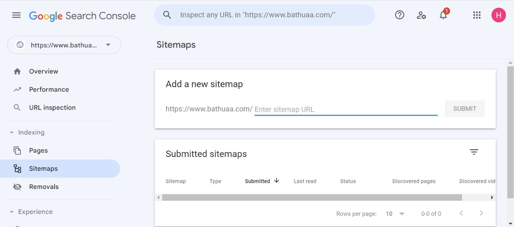
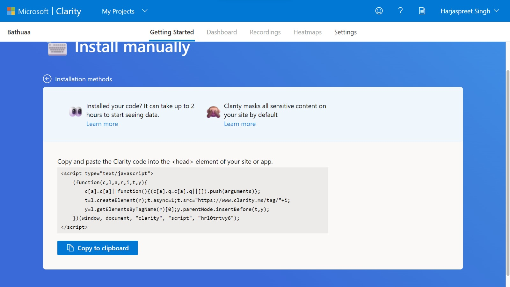

<h1>SEO: Search Engine Optimization</h1>

    
Portfolio

    <ol>
        <li>Go to <a href="https://repo.new">repo.new</a></li>
        <li>Create a repo with a name: <b>{your-username}.github.io</b>. e.g. My GitHub Username: <b>ssahibsingh</b>, So repo name: <b>ssahibsingh.github.io</b></li>
        <li>Upload all the content of your portfolio in that</li>
        <li>Go to settings and enable github pages</li>
        <li>Clone the repo in your laptop or PC or local with help of GitHub Desktop</li>
        <li>Open the folder in VS Code</li>
        <li>Add metatags in <b>index.html</b> file using <a href="https://metatags.io"><i>Metatags.io</i></a> as instructed</li>
    </ol>

    
Google Search Console

    

        Step 1: 
         
        Step 2: 
         
        Step 3: 
         
        Step 4: 
         
        Step 5: 
         
        Step 6: 
         
        Step 7: 
         
        Step 8: 
         
        Step 9: 
         
        Step 10: 
         
    

    
Microsoft Clarity

    

        Step 1: 
         
        Step 2: 
         
        Step 3: 
         
        Step 4: 
         
        Step 5: 
         
    

